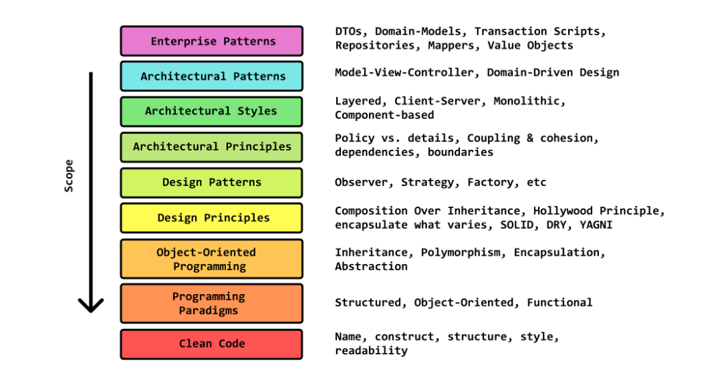

### Folders structure
* [Folders structure](https://softwareengineering.stackexchange.com/questions/338597/folder-by-type-or-folder-by-feature)
* Good approach is mixed: folders by feature => folder by type OR folders by type => folder by feature
    * With single class in package root (as package interface), everything else should be hidden in folders (as implementation details)
* Bad approach example [(1700 files in one folder)](https://github.com/nodejs/node/tree/master/test/parallel) 
    
### Folders structure
* Folder by feature (great):
    * `diagnosis`
        * `controller`
        * `dto`
        * `entity`
        * `mapper`
        * `repository`
        * `service`
        * `specification`
        * `validator`
* Folder by type (horrible):
    * `dto`
        * `diagnosis`
        * `call`
    * `entity`
        * `diagnosis`
        * `call`
    * `mapper`
        * `diagnosis`
        * `call`
* Package interface examples - @RestController, @Service, @Repository   
    
### Schemas/Diagrams
* `Sequence diagram` - sequence of message exchange (e.g. method calls between systems)
    * Good way to show how method works
* 

### Error handling
* Unchecked exceptions in most cases better than checked
    * Look at `java-dependencies` repository, `java-spring` package
### Architecture levels

