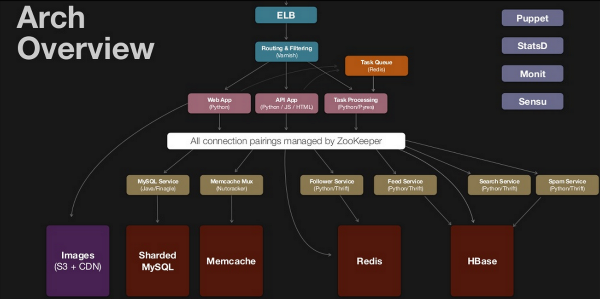

Based on [this](https://github.com/puncsky/system-design-and-architecture/blob/master/en/2016-02-13-crack-the-system-design-interview.md)

* `ELB` - Load balancer (distributes incoming application traffic across multiple targets)
* `Varnish` - Reverse Proxy (directs client requests to the appropriate backend server)
* `StatsD/Monit/Sensu` - Monitoring (shows resource usage/system state/failing components)
* `Redis/Memcached` - In-memory key–value database (NoSQL is way faster than relational DB)
* `Web app` - Application that runs on a server, usually accessed by user via web-browser
* `S3` - Amazon Simple Storage Service
* `CDN` - Content delivery network (geographically distributed network of data centers)
* `Zookeper` - Coordination service for distributed apps (stores shared configuration, elects master node, allows services to find each other)
* `Sharded MySQL` - Tables split between multiple servers
* `HBase` - Hadoop database (a distributed, scalable, big data store)
* `Follower/Feed/Search/Spam service` - bunch of micro services (loosely coupled, independently deployable)
