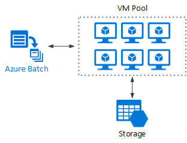

* `Big compute` - large-scale workloads (100+ cores / 100+ GB RAM)
* `Use cases`
    * Simulations, number crunching, modeling
    * Image rendering, fluid dynamics, drug design, engineering stress analysis 
* `Characteristics`
    * Work can be split into independent tasks
    * Each task takes input, processes it, produces output
* Architecture:
> 