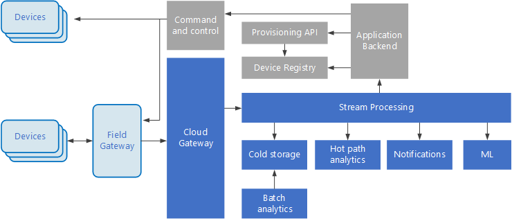

* `Big data` - analyze/extract/process data (1 TB+) 
* `Use cases`
    * Predictive analytics / machine learning
    * Real-time processing of big data in motion
    * Batch processing of big data sources at rest
* `Benefits`
    * Performance through parallelism
    * Elastic scale
* `Challenges`
    * `Complexity` - hard to build, test, troubleshoot, configure
    * `Skillset` - highly specialized technologies
* `Best practices`
    * Leverage parallelism, Partition data, Process data in-place (TEL)
    * Balance utilization and time costs, Scrub sensitive data early
    * `Apply schema-on-read semantics` - project a schema onto the data when the data is processing, not when the data is stored
    * `Separate cluster resources` - e.g. one for Hive, another for Spark
* `Architecture. Big data`
    * 
    * `Data source` - database, log files, events stream
    * `Data storage` - distributed file store (data lake)
    * `Batch processing` - filter, aggregate, prepare data for analysis (e.g. map/reduce)
    * `Analytical data store` - data in structured format for analytical tools (e.g. NoSQL)
    * `Analysis and reporting` - insights into the data through analysis and reporting (e.g. OLAP)
    * `Orchestration` -  workflow automation
* `Architecture. IoT`
    * 
    * `Cloud gateway` - ingests device events using messaging system
    * `Field gateway` - optional mediator (preprocess the raw device events)
    * `Stream processors` - route/analyze/process data
        * `Cold storage` - for archiving or batch analytics`
        * `Hot path analytics` - real time analysis to detect anomalies, recognize patterns, trigger alerts
    * `Device registry` - database of the provisioned devices
    * `Provisioning API` - provision/register new devices
