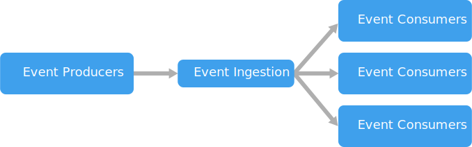

* `Event driven` - event producers + event consumers
* `Use cases`
    * Multiple subsystems must process the same events (as subscribers)
    * Real-time processing
    * High volume and high velocity of data
    * Pattern matching or aggregation over time windows
* `Benefits`
    * Producers and consumers are decoupled
    * Easy to add new consumers
    * Consumers get events immediately
    * Scalable and distributed
* `Challenges`
    * Guaranteed delivery
    * Processing in strict order, or exactly once
* Models
    * `Pub/sub` - messaging service which decouples producers from subscribers
    * `Event streaming` - client can read from any part of the stream
* Architecture
> 
