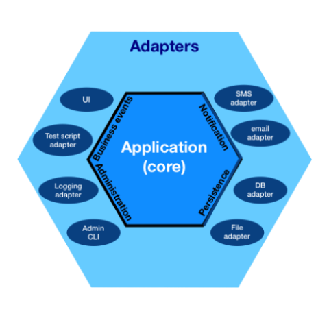

* `Hexagonal architecture` (Ports and adapters)
  * Separate core business logic from external systems through ports (interfaces) and adapters (implementations)
* In case of message queue - messaging mechanism is a port, while specific listener/sender is an adapter
* In case of HTTP - http mechanism is a port, while specific message handler is an adapter (e.g. `@RestController -> @GetMapping`)
* For example:
  * Port "Logging" with "Graylog adapter" and "Stdout adapter"
  * Port "Persistence" with "Postgres adapter" and "Mongo adapter"
  * Port "Notification" with "SMS adapater" and "Email adapter"
  * So hexagonal architecture never interacts with implementations directly e.g. `smsNotificationService.send()` \
    But instead interacts with interfaces e.g. `abstractNotificationService.send()`
> 