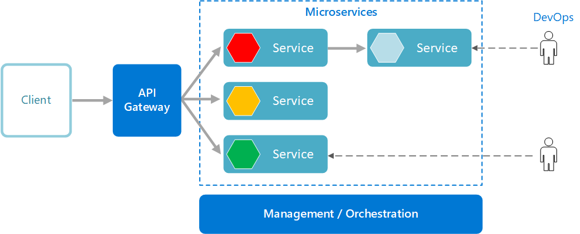

# Microservices architecture

* `Microservices` - collection of small, autonomous services
* `Advantages`. Each service is:
    * Focused (implements single business capability)
	* Self-contained, independent, Loosely coupled with other services (enables independent work, scope of problem is small and simple)
	    * E.g. each service has its own DB
	* Highly maintainable and testable (fast development and deployment)
	* Scalable - if one service experience high load - automatically deploy more instances
	* Durable (fault isolation) - if one service fails and unable to start - others continue working (without features of fallen service)
	* Communicates with others via API (implementation details hidden)
* `Drawbacks`:
	* Each service is simple, but overall app is complex (inter-service communication, testing, infrastructure, transactions)
	    * Want transaction in a monolith? Just add @Transactional. Want same across microservices? Good luck.
	    * Want to gather data from different tables, with filtering and pagination? In a monolith - use `INNER JOIN`, in microservices - good luck.
	* Hard to make global changes (e.g. bumping library version or changing logging format in each microservice takes a long time)
	* Network congestion and latency (all communications done via network)
	* Data integrity (each service is responsible for its own data persistence). Embrace eventual consistency
	* Versioning. Changes in one service shouldn't break others
* `Example`:
    * News site page with weather broadcast, exchange rates, most popular news articles, feedback form. 
    * Each of those is independent backend service
* `Archtecture`
    * Frontend -> Facade -> All other microservices
        * Microservices don't know about each other. If you need to send requests to multiple services - use facade.
    * 
    * 
* `Components`
    * `Management/orchestration` - placing services on nodes, identifying failures, rebalancing (e.g. Kubernetes)
    * `API Gateway` - entry point for clients (auth, load balancing, logging, caching etc)
* `Etc`
    * Use monorepo, otherwise to make 1 small change in 20 microservices - you have to edit 20 projects, create 20 branches, open 20 merge requests
    * [Macroservices](https://www.reddit.com/r/programming/comments/nzemqn/disasters_ive_seen_in_a_microservices_world/)
        * Less complexity, almost same benefits
    * [Practical Guide](https://www.marcobehler.com/guides/java-microservices-a-practical-guide)
    