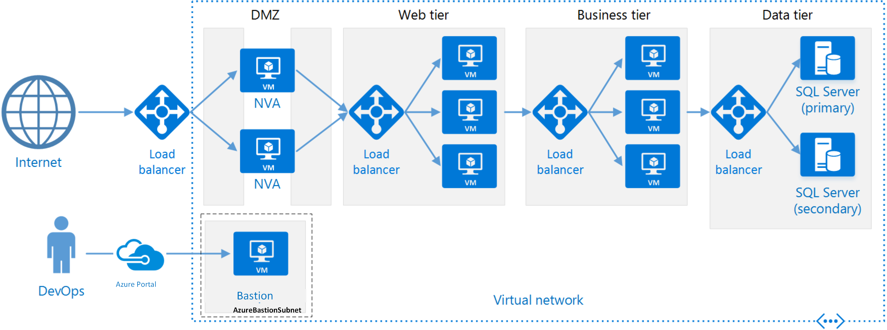

* `n-tier` divides an app into logical layers and physical tiers (e.g. web, business, data)
    * Typically, implemented as IaaS
* `Types`
    * `Closed layer architecture` - layer can only call the next layer immediately down
    * `Open layer architecture` - layer can call any of the layers below it
* `Use cases`
    * Simple web apps
    * Migrating an on-premises application to cloud with minimal changes
    * Unified development of on-premises and cloud applications
* `Architecture`
> 
