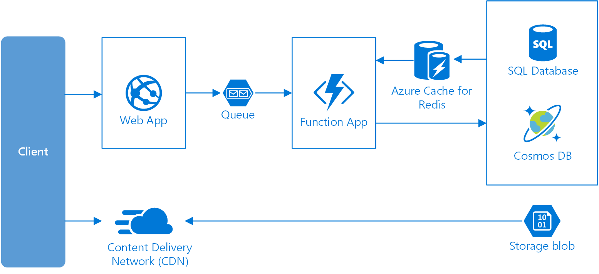

* `Web-queue` - 
* `Use cases`
    * Simple domain, long running jobs, batch operations 
* `Architecture`
    * 
* TODO
    * https://docs.microsoft.com/en-us/azure/architecture/guide/architecture-styles/web-queue-worker
