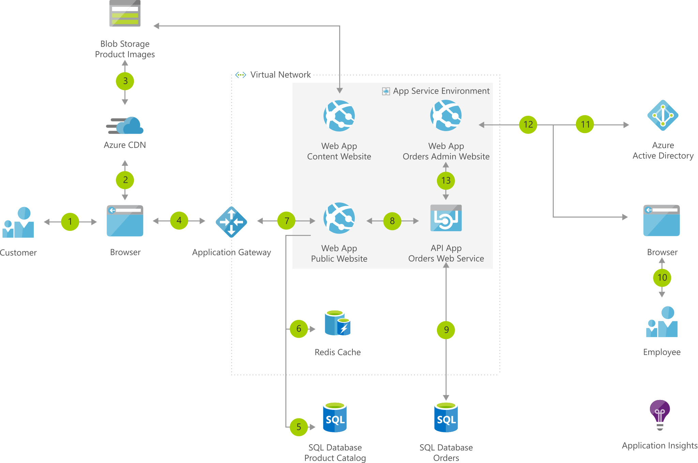

### Dataflow
1. Customer accesses the public website in browser.
2. Browser pulls static resources and product images from Azure Content Delivery Network.
3. Content Delivery Network pulls product images from blob storage.
4. Customer searches for products.
5. Public website pulls product catalog from product database.
6. Page output is cached in the Azure Cache for Redis.
7. Customer creates new orders.
8. Public website invokes orders web service.
9. Orders web service saves/loads orders from Azure SQL Database.
10. Employee accesses the admin website in browser.
11. Employee authenticates against Azure Active Directory (Azure AD).
12. Employee searches orders.
13. Admin website invokes orders web service.