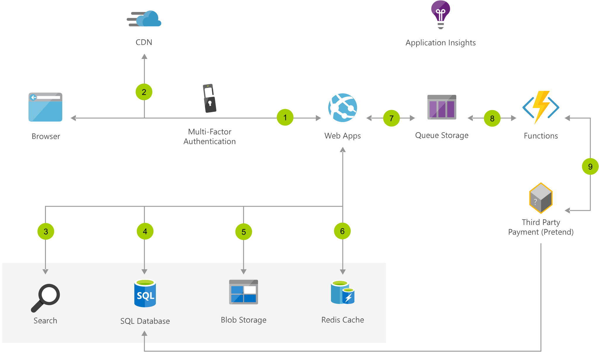

### Dataflow
1. User accesses the web app in browser and signs in.
2. Browser pulls static resources such as images from Azure Content Delivery Network.
3. User searches for products and queries SQL database.
4. Web site pulls product catalog from database.
5. Web app pulls product images from Blob Storage.
6. Page output is cached in Azure Cache for Redis for better performance.
7. User submits order and order is placed in the queue.
8. Azure Functions processes order payment.
9. Azure Functions makes payment to third party and records payment in SQL database.
