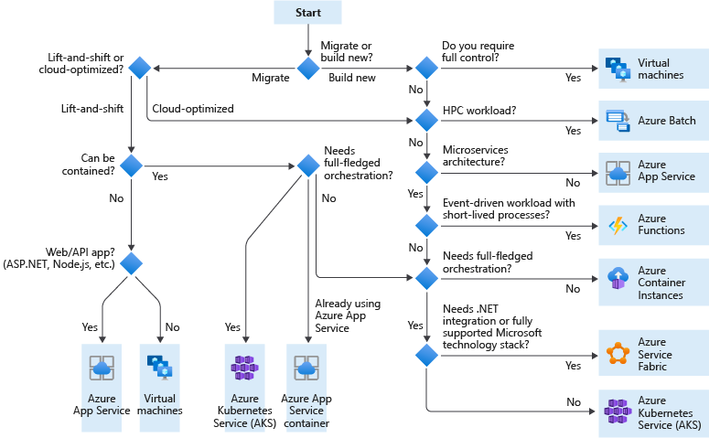

### IaaS vs PaaS
| Instead of running... | Consider using...      |
|-----------------------|------------------------|
| Active Directory      | Azure Active Directory |
| Elasticsearch         | Azure Search           |
| Hadoop                | HDInsight              |
| IIS                   | App Service            |
| MongoDB               | Cosmos DB              |
| Redis                 | Azure Cache for Redis  |
| SQL Server            | Azure SQL Database     |
| File share            | Azure NetApp Files     |
[Source](https://docs.microsoft.com/en-us/azure/architecture/guide/design-principles/managed-services)

### Compute service

### Load balancing

### Others
* [Data store](https://docs.microsoft.com/en-us/azure/architecture/guide/technology-choices/data-store-overview)
* [Messaging service](https://docs.microsoft.com/en-us/azure/architecture/guide/technology-choices/messaging)
* 
* 
