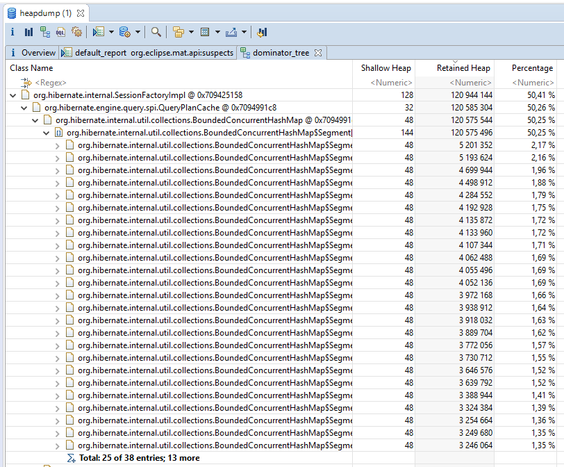

#### Memory leaks
* Memory leak: too much data stored in RAM (e.g. query cache, query plans)
* To find:
    * Check metrics (e.g. grafana)
    * Get heap dump, analyze it
* Reproduce the problem in test environment:
    * Non-stop send requests from 100 threads
    * Each request should be unique (different parameters)
* Typical problems:
    * [IN clause](https://stackoverflow.com/questions/31557076/spring-hibernate-query-plan-cache-memory-usage)
        * Gradually increment parameters count (e.g. from 1 to 10000). Plan for each query will be stored in RAM.
            * https://stackoverflow.com/questions/31557076/spring-hibernate-query-plan-cache-memory-usage
            * How it looks like in java dump (Eclipse MemoryAnalyzer):
                
        * Fix - decrease 'query plan' cache size (Hibernate)
            * `hibernate.query.plan_cache_max_size=16`
            * `hibernate.query.plan_parameter_metadata_max_size=8`
    * Big amount of queries text in dump (e.g. dynamic queries that are unlikely to be reused)
        * Warning - not really sure about this one.
        * Fix - turn off 'prepared statement' cache (Postgres connection)
            * `jdbc:postgresql://potr-db-t:5432/puds2?preparedStatementCacheQueries=0`

#### Connection leaks
* Connection leak: transaction (connection) open for too long. Leads to lack of available connections.
    * Error example: `Unable to acquire JDBC Connection. HikariPool-2 - Connection is not available, request timed out after 30000ms`
* To reproduce: put sleep inside transactional method, execute it multiple times.
* To find/fix (`HikariCP`):
    * `spring.datasource.hikari.leak-detection-threshold=35000`
        * Will write in logs `Connection leak detection triggered`, `Apparent connection leak detected`
    * `<logger level="DEBUG" name="com.zaxxer.hikari" />`
        * Shows parameters on start (`jdbcUrl, maximumPoolSize, leakDetectionThreshold`)
        * Shows pool stats every 30 seconds `(total=9, active=1, idle=10, waiting=0)`
