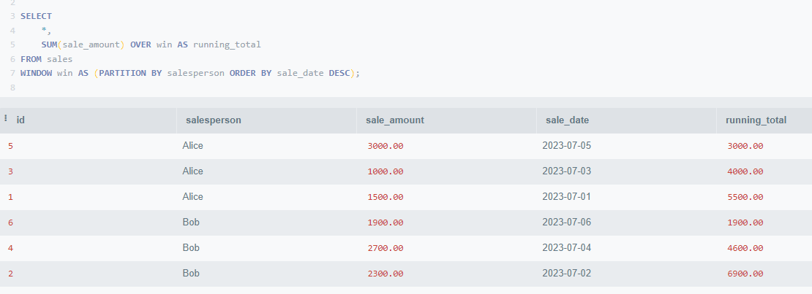

# SQL
* Explain visualizer
    * https://tatiyants.com/pev/#/plans

## Queries
* Get id of record with biggest/smallest value
    ```
    SELECT id FROM users
    ORDER BY points DESC LIMIT 1;
    ```
* Sane way to handle nulls:
    ```
        SELECT * FROM contact
        WHERE COALESCE(home_phone, '') <> COALESCE(mobile_phone, '')
    ```
* Update based on value in other field
    ```
    UPDATE customer
    SET status_enum = CASE
      WHEN status = 0 THEN 'INIT'
      WHEN status = 1 THEN 'LOADING'
      WHEN status = 2 THEN 'DONE'
    END;
    ```
* Insert/Update
    ```
    INSERT INTO task (id, type, created_at, direction) 
    VALUES(123, 'EXPO', 'today', 'RIGHT') 
    ON conflict(id) DO UPDATE 
    SET 
        type = EXCLUDED.type,
        created_at = EXCLUDED.created_at,
        direction = EXCLUDED.direction
    ```
* Update/Insert based on a bunch of selects
    ```
    MERGE INTO unique_trade_object uto
      USING (
        ... a lot of selects
      ) o ON (uto.id = o.uto_id)
      WHEN MATCHED THEN
        UPDATE SET uto.address = o.alternative_address
      WHEN NOT MATCHED THEN
        ... insert or ignore
    ```
* Update based on a bunch of selects (main)
    ```
    WITH o as (
        ... a lot of selects
    )
    UPDATE unique_trade_object uto
    SET uto.address = o.alternative_address
    WHERE uto.id = o.uto_id -- For optimization - use inner join instead
    ```
* Update based on a bunch of selects (alternative)
    ```
    UPDATE unique_trade_object uto
    SET uto.address = o.alternative_address
    FROM (
        ... a lot of selects
    ) AS o
    WHERE uto.id = o.uto_id
    ```
* Calculate count of rows with unique conditions
    ```
    SELECT 
      house_id,
      COUNT(*) AS total_count,
      SUM(CASE WHEN filtered.visit_type = 'SPECIAL' THEN 1 ELSE 0 END) AS special_count,
      SUM(CASE WHEN filtered.age >= 1 and filtered_visit.age < 10 THEN 1 ELSE 0 END) AS chlidren_count
    from filtered
    group by filtered.house_id
    ```
* Complex query structure (subqueries)
    ```
    WITH 
      specials AS (SELECT * FROM ...),
      verifications AS (SELECT * FROM ...),
      cadnumbers AS (SELECT * FROM ...)
    SELECT 
      fluff_id,
      CASE WHEN sto_type = 'EXTRA_SIGN' THEN 'Sign found' ELSE 'Sign not found' END AS tip
    FROM specials
    LEFT JOIN verifications ON verifications.id = specials.ver_id
    LEFT JOIN cadnumbers ON cadnumbers.id = verifications.cad_id
    ```
* Find last message of each user:
    ```
    WITH ranked_messages AS (
        SELECT 
            user_id, message, timestamp,
            ROW_NUMBER() OVER (PARTITION BY user_id ORDER BY timestamp DESC) AS rank
        FROM messages
    )
    SELECT * FROM ranked_messages WHERE rank = 1;
    ```
* WINDOW functions:
    * TLDR: same as GROUP BY, but without reducing number of rows
    * Examples:
    
    
* Cursors:
    * TLDR - same idea as pagination in REST API, useful when data set is too large
    
* Combine inserts/updates:
    ```
    WITH updated_customers AS (
         UPDATE customer
         SET discount = 20
         WHERE status = 'vip'
         RETURNING id, name, product_id
    ),
    created_products AS (
        INSERT INTO product(name)
        SELECT special_name
        FROM outdated_products
        RETURNING id, name, timestamp 
    )
    INSERT INTO revision (rev_name, rev_product)
    SELECT name, product_id
    FROM updated_customers 
    INNER JOIN created_products ON updated_customers.product_id = created_products.id 
    ```
