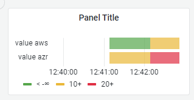

# Dashboard widgets

#### Time series:

```
SELECT NOW() - INTERVAL '4 minutes' AS time, 12 AS value, 4 as sum
UNION
SELECT NOW() - INTERVAL '1 minutes', 3, 9 
```

#### Bar chart:

```
SELECT NOW() - INTERVAL '4 minutes' AS time, 12 AS value
UNION
SELECT NOW() - INTERVAL '3 minutes', 8
UNION
SELECT NOW() - INTERVAL '2 minutes', 10
```
* Similar to `Bar gauge`

#### Stat:

```
SELECT NOW() AS time, 37 AS value
```
* Similar to `Gauge`

#### Table:

```
SELECT NOW() - INTERVAL '4 minutes' AS time, 12 AS value, 4 as sum
UNION
SELECT NOW() - INTERVAL '1 minutes', 3, 9 
```

#### Pie chart:

```
SELECT NOW() AS time, 28 AS bws, 23 AS dip, 16 AS ske
```

#### State timeline:

```
select * from (
SELECT NOW() - INTERVAL '2 minutes' AS time, 'aws' as grp, 8 AS value
UNION
SELECT NOW() - INTERVAL '2 minutes', 'azr' as grp, 14
UNION
SELECT NOW() - INTERVAL '1 minutes', 'aws' as grp, 14
UNION
SELECT NOW() - INTERVAL '1 minutes', 'azr' as grp, 23
) as q order by time asc
```
* Similar to `Heatmap`, `Status history`

#### Text (markdown/html):
```
# Welcome to My Grafana Dashboard
This is a sample text widget.
- Item 1
- Item 2

For more information, visit [Grafana website](https://grafana.com).
```