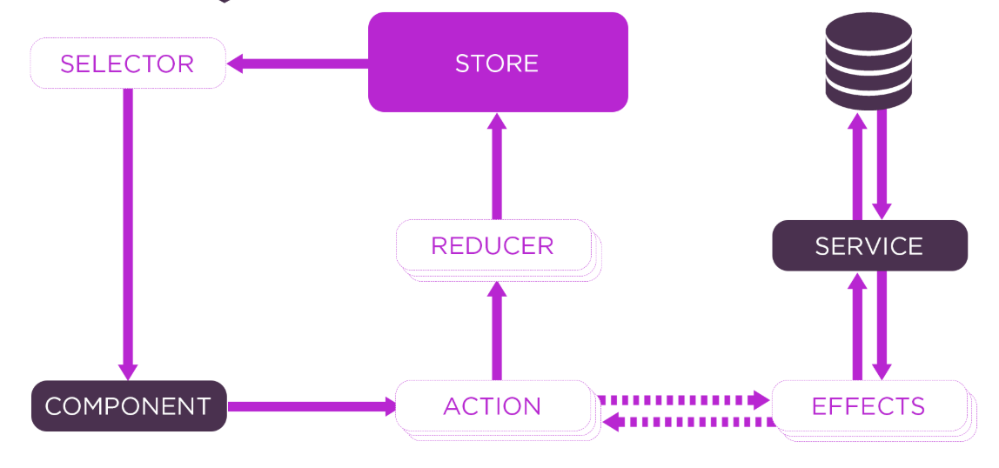

#### Overview
`Redux` - JS library for managing application state
* Consists of:
    * `Effect`
        * Effects are where you handle tasks such as fetching data, long-running tasks that produce multiple events, and other external interactions
        * Effects perform tasks and return a new action
    * `Action`
        * Actions express unique events that happen throughout your application
        * From user interaction with the page, external interaction through network requests, and direct interaction with device APIs, these and more events are described with actions
    * `Reducer`
        * Reducers are pure functions - they produce the same output for a given input, without side effects
        * Each reducer function takes the latest Action dispatched, the current state, and returns new state
    * `Store`
        * A store holds the whole state tree of your application. The only way to change the state inside it is to dispatch an action on it
    * `Selector`
        * A selector is a function that accepts Redux state as an argument and returns data that is derived from that state
    * `Component`
        * Components are the most basic UI building block of an app. A component controls a patch of screen called a view
* Useful Google Chrome extensions - `Redux DevTools`

#### CLI
* Generate basic app
    * `npx create-react-app my-app --template redux`

#### Diagram

* Starts with "Component initiates action..."
